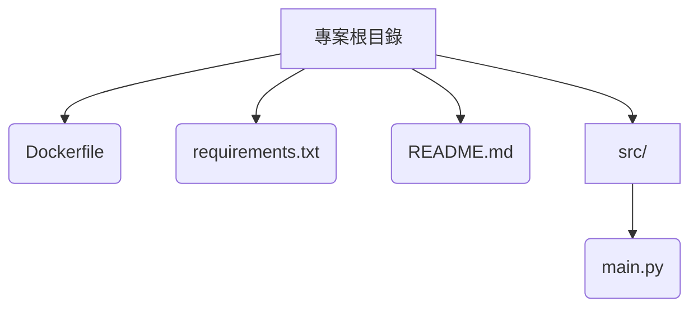

# syno-helper

syno-helper 是一個用於監聽 ACME JSON 檔案後自動將憑證上傳至 Synology NAS 的工具。

## 使用方式

首先設定以下環境變數：

- `SYNO_HELPER_HOST` - Synology 主機 IP 或 Hostname
- `SYNO_HELPER_PORT` - DSM API 連接埠，預設 5000
- `SYNO_HELPER_USER` - 登入帳號
- `SYNO_HELPER_PWD` - 登入密碼
- `SYNO_HELPER_OTP` - 可選，TOTP URI
- `SYNO_HELPER_CERT_DESC` - 可選，憑證說明用於更新舊憑證
- `SYNO_HELPER_ACME_PATH` - ACME JSON 檔案路徑
- `SYNO_HELPER_ACME_RESOLVER` - ACME resolver 名稱
- `SYNO_HELPER_ACME_CERT_DOMAIN` - 憑證對應的主域

在環境設定完成後，可以依需求有以下兩種方式啟動程式：

### Docker

```bash
docker run --rm \
  -e SYNO_HELPER_HOST=your-nas \
  -e SYNO_HELPER_USER=admin \
  -e SYNO_HELPER_PWD=password \
  -e SYNO_HELPER_ACME_PATH=/path/to/acme.json \
  -e SYNO_HELPER_ACME_RESOLVER=myresolver \
  -e SYNO_HELPER_ACME_CERT_DOMAIN=example.com \
  your-image:latest
```

### 直接執行

```bash
python src/main.py
```

程式會定期檢查 ACME JSON 檔案，一旦有更新就重新匯出憑證並上傳至 Synology。

## 專案架構


