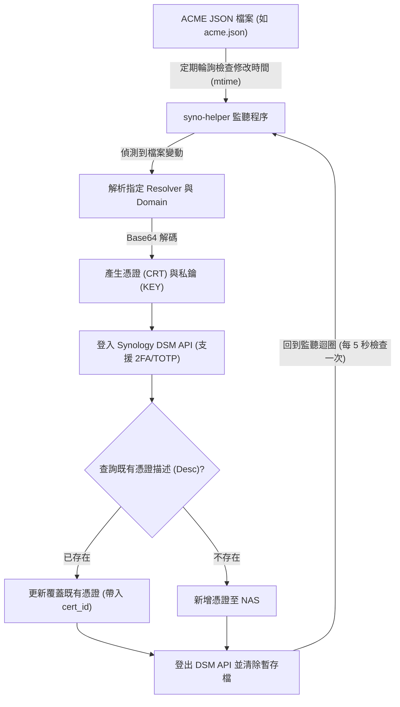

# syno-helper

syno-helper 是一個用於監聽 ACME JSON 檔案（例如 Traefik 所產生）後，自動將憑證與私鑰上傳／更新至 Synology NAS 的自動化工具。

本專案使用 [uv](https://docs.astral.sh/uv/) 進行 Python 套件與專案管理。

## 運作流程



1. **檔案監聽**：程序每 5 秒檢查一次 `SYNO_HELPER_ACME_PATH` 的修改時間（`mtime`）。
2. **提取憑證**：一旦檔案被 ACME 用戶端（如 Traefik）更新，即解析 JSON 並取得對應 resolver 與 domain 的 base64 憑證及私鑰。
3. **驗證與比對**：透過 API 登入 Synology DSM（支援 TOTP 動態驗證），並依據設定的描述名稱（Desc）查詢是否已存在舊憑證。
4. **同步上傳**：若舊憑證存在則更新覆蓋，若不存在則直接新增；完成後登出並立即清除本機暫存檔案。

## 環境變數設定

| 環境變數 | 必要性 | 預設值 | 說明 |
| :--- | :---: | :---: | :--- |
| `SYNO_HELPER_HOST` | **必要** | - | Synology NAS 主機 IP 或網域名稱 |
| `SYNO_HELPER_PORT` | 選填 | `5000` | DSM WebAPI 連接埠 |
| `SYNO_HELPER_USER` | **必要** | - | 登入帳號（需具備 **administrators** 群組權限） |
| `SYNO_HELPER_PWD` | **必要** | - | 登入密碼 |
| `SYNO_HELPER_OTP` | 選填 | - | TOTP URI（若帳號有啟用二步驟驗證時填寫） |
| `SYNO_HELPER_CERT_DESC` | 選填 | `default` | 憑證說明名稱（用於比對或更新舊憑證） |
| `SYNO_HELPER_SET_AS_DEFAULT` | 選填 | `false` | 是否將上傳的憑證設為 DSM 預設憑證（`true` / `false`） |
| `SYNO_HELPER_ACME_PATH` | **必要** | - | 容器內 ACME JSON 檔案路徑（如 `/app/acme.json`） |
| `SYNO_HELPER_ACME_RESOLVER` | **必要** | - | Traefik 中設定的 ACME resolver 名稱 |
| `SYNO_HELPER_ACME_CERT_DOMAIN` | **必要** | - | 憑證對應的主網域名稱（如 `example.com`） |

## 使用方式

### 1. Docker

> [!TIP]
> 請務必使用 `-v` 將主機上的 `acme.json` 掛載進容器。

```bash
docker run -d --name syno-helper \
  --restart unless-stopped \
  -v /path/to/acme.json:/app/acme.json:ro \
  -e SYNO_HELPER_HOST=192.168.1.100 \
  -e SYNO_HELPER_USER=admin \
  -e SYNO_HELPER_PWD=yourpassword \
  -e SYNO_HELPER_ACME_PATH=/app/acme.json \
  -e SYNO_HELPER_ACME_RESOLVER=myresolver \
  -e SYNO_HELPER_ACME_CERT_DOMAIN=example.com \
  -e SYNO_HELPER_CERT_DESC=example.com \
  -e SYNO_HELPER_SET_AS_DEFAULT=false \
  your-image:latest
```

#### 或使用 Docker Compose

```yaml
version: "3.8"
services:
  syno-helper:
    image: your-image:latest
    container_name: syno-helper
    restart: unless-stopped
    volumes:
      - /path/to/traefik/acme.json:/app/acme.json:ro
    environment:
      - SYNO_HELPER_HOST=192.168.1.100
      - SYNO_HELPER_USER=admin
      - SYNO_HELPER_PWD=yourpassword
      - SYNO_HELPER_ACME_PATH=/app/acme.json
      - SYNO_HELPER_ACME_RESOLVER=myresolver
      - SYNO_HELPER_ACME_CERT_DOMAIN=example.com
      - SYNO_HELPER_CERT_DESC=example.com
      - SYNO_HELPER_SET_AS_DEFAULT=false
```

### 2. 直接執行 (本機開發)

```bash
# 透過 uv 直接執行
uv run syno-helper

# 或透過 Python 腳本執行
uv run python src/main.py
```

## 開發與程式碼檢查

本專案使用 [Ruff](https://docs.astral.sh/ruff/) 進行代碼檢查與排版：

```bash
# 檢查代碼
uv run ruff check .

# 自動修復建議問題
uv run ruff check --fix .

# 排版格式化
uv run ruff format .
```
